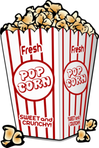

```{r setup, include=FALSE}
knitr::opts_chunk$set(echo = FALSE)
```
Can you read this? 

***%V   2@?    *%%#!**

The task is impossible without knowing what each symbol represents. However, if you know that % = o, you can more easily “crack the code”. And, if you also know that * = g, you might be able to decipher the message based on your prior knowledge about words that begin with go (the phrase is: *Got it? Good!*). So knowing a few symbols (“letters”) combined with background knowledge can enable you to “read” this “foreign language” text. 

# Why teach children about the alphabet in PreK?
There are two main advantages to introducing the alphabet to Prekindergarten children. First, it helps prepare children for reading development by establishing the “basic building blocks” used in word decoding. Children who [enter Kindergarten with strong alphabet knowledge](https://journals.sagepub.com/doi/pdf/10.1177/0022219410369067) are more likely to become successful beginning readers. Second, it helps children connect with the printed world around them in ways that can stimulate their cognitive (attention, reasoning), language, fine motor, and emotional growth BEFORE they can read. This is important for building motivation to reading by helping children link what they hear and say with what they see and think/feel. For example, they will be more likely to want to "read" printed stories, write messages for expressing themselves, and connect concepts in their world (e.g., linking the word STOP with their understanding of stop signs around town, and in their play with toys, as a signal to not move).

# What about the English alphabet should be learned in PreK?

•	**Letter Names**- to provide a label for the symbol written and the sound spoken (A)

•	**Letter Sounds**- to provide a link between a letter’s spoken and written form (/a/).

•	**LNS (Letter Name & Sound) Connections**- to provide a bridge between concepts children know and their literacy representations (when speaking, reading, writing).


                           
Research shows that learning in isolation (e.g., learning letter names or sounds by themselves) is less effective than [connected, multi-skill learning](https://ila.onlinelibrary.wiley.com/doi/pdf/10.1598/RRQ.45.1.2). Similar to teaching children about how pedaling and steering are pre-requisite skills needed to ride a bike, teaching children about the alphabet is more effective when learned with other pre-requisite word reading skills. For example, a basic building block for literacy is to teach children using a 3-part strategy: knowing a letter’s name (“A”), the sounds it makes (long sound ā or short sound â), and its letter-sound connection to concepts they already know (apple, Ana, Ash, ad, ants, axe- *notice that I used words that make the same /a/ sound; including words with both sounds at the same time when learning can be confusing*). 

Teaching children letter names helps to make literacy functional (because we know what to call the letter when we see or write it). However, knowing a letter’s name is not enough to help children later learn how to read words- a letter’s sound must be integrated with children’s understanding about its written form, or shape. So, knowing a letter’s name assists with learning its sound, and understanding how they both are connected to a child’s world (through the letter's relevance to different concepts they know) helps to create a purpose and motivation for literacy learning. This combination “unlocks” literacy skill development in ways that benefit reading by laying the sight, sound, and knowledge foundation for future decoding. Children who don’t efficiently acquire these connections can begin kindergarten with delays in reading skill development that lead to [persistent problems in reading](https://www.sciencedirect.com/science/article/pii/S1041608016300693).

# How can alphabet knowledge be intentionally learned in PreK?

•	**Meaningfully**: Begin with using words that are important to each child (e.g., names they know, short words that begin with the LNS Connection). Learning is more effective when it matters to the learner. See the “Deans for Impact” [report](https://deansforimpact.org/wp-content/uploads/2017/01/The_Science_of_Early_Learning.pdf) (2019), which briefly describes this, and other basic cognitive principles involved in early learning.

•	**Simply**: Start with using CAPITAL LETTERS to help children learn how to identify and locate beginning letters (*capital letters are less visually confusing, and beginning letters are easier to find than letters at the middle or end of a word*). Remember that in the early stages of alphabet learning, children are figuring out how to associate letter form, letter sound, and the connection to concepts/words they know (to understand how shapes and sounds are the written forms of the words we speak). As children are ready, lowercase letters and/or letters located at the middle or end of words can be used to add challenge, but helping children basic master letter form and sound identification principles should remain the primary goal (later, in kindergarten, they will be taught how to playfully move around letters and sounds to make different words, as well as the lowercase forms of all 26 letters in the English alphabet). Research has shown that [knowing uppercase letters first](https://journals.sagepub.com/doi/pdf/10.1177/1529100618772271) faciliates later learning of lowercase forms by providing a clear and consistent foundation about how alphabetic letters look.


•	**With Writing**: Multisensory learning helps to create multiple mental pathways for remembering, which can help children [strengthen their development](https://www.researchgate.net/profile/Helene_Labat/publication/273474444_Facilitating_Effect_of_Multisensory_Letter_Encoding_on_Reading_and_Spelling_in_5-Year-Old_Children/links/5cd19850458515712e989d75/Facilitating-Effect-of-Multisensory-Letter-Encoding-on-Reading-and-Spelling-in-5-Year-Old-Children.pdf) of letter sounds knowledge. [Integrating audio (sound) and visual](https://www.sciencedirect.com/science/article/pii/S0167876010001698) (letter) information is effortful, so writing can help make this linking become more familiar. Practice with writing letters can also strengthen learning beyond print recognition by encouraging children's motivation to use letters for communication. 
                     

•	**Repeatedly**: Memorizing the letter shape that “goes with” a particular sound is a big concept. More real-world examples of LNS Connections, and more frequently repeated [practice](https://www.cambridge.org/core/services/aop-cambridge-core/content/view/B71581638BF89873F61F03EA1E747E5A/S0272263197002040a.pdf/div-class-title-beyond-explicit-rule-learning-div.pdf) can increase children’s mastery of this fundamental language concept, which is necessary for decoding words. This means noticing a LNS Connection multiple times a day (using different examples: apple, Ana, ad, ants, axe), multiple days within a week, multiple weeks across a month. In general, the better children understand how word reading “works”, the more instinctively they will be able to expand this knowledge to other letters.

                        
•	**With High-Quality Book Reading**: High quality reading (in which reading is interactive between the reader and child, and the book content is engaging and leads to new/deeper understandings) supports LNS Connecting in multiple ways. It helps children organize literacy skill development by facilitating their understanding about print concepts, such as left-to-right reading across a page (how reading happens), word boundaries (what is read), and how ideas are reflected in print (which forms the why people read: to learn information or enjoy stories that resonate with them). [Shared book reading](https://www.sciencedirect.com/science/article/pii/S0885200608000082) also expands vocabulary and knowledge as teachers and children co-create a story’s meaning, which can expand the diversity of words that children know.

•	**Using Intentional Language**: Speech, like action, focuses children’s attention. When teachers intentionally point out alphabet letters and sounds, they help to make connections clear and concrete. Explicit learning of alphabetic principles is [more helpful](https://journals.sagepub.com/doi/pdf/10.1177/1529100618772271) than incidental learning. Explicit teaching doesn’t have to be boring- it just has to be clear with the teacher using language that focuses attention to learning goals with enthusiasm. For example, compare the way two teachers point out a LNS Connection. Teacher 1: “We’re eating popcorn, and popcorn begins with the letter P! What sound do you hear when I say…PoPcorn?” Teacher 2: “We’re eating POPcorn! Pop! Pop! Pop! I loooove buttered popcorn! P is for popcorn, our letter this week.” *Notice that in the 2nd example, there’s extra (unnecessary) wording and no specific connection between the letter P, it’s /p/ sound, and the popcorn snack, even though the teacher emphasizes /p/ by repeating “pop”. Although she mentions that P is the letter for the week, this vaguely focuses children's attention to the learning goal.* Children are less likely to learn the P + /p/ are connected in the 2nd attempt because the teacher is less explicit and intentional.


 
# Take-home message: 
With some basic intentional principles, PreK children can learn some basic building blocks of word reading, to give them a successful start to Kindergarten reading development by starting solid literacy habits based on curiosity, interest, practice, and reasoning. PreK teachers who make learning LN, LS, and LNS Connections for at least 7 - 10 alphabet letters a priority across the year, can help to strengthen and positively shape how well children later learn to read. What matters most is the *quality*, and not the *quantity*, of alphabet learning in PreK.


