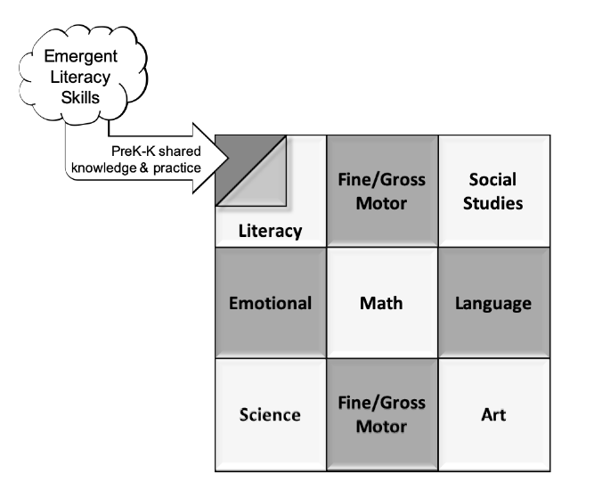

```{r setup, include=FALSE}
knitr::opts_chunk$set(echo = FALSE)
```
# What’s the problem?

Nearly 1/3 of U.S. fourth graders read below “Basic” level expectations in reading, and [this statistic has not changed much](https://nces.ed.gov/pubs2019/2019144.pdf) within the past decade. “Basic” level performance indicates partial mastery of critical reading skills, and current gaps in information-sharing between Preschool and Kindergarten literacy learning experiences contribute to this wide-spread problem. In particular, Kindergarten teachers need an early understanding of children’s emerging literacy development at the beginning of the school year to efficiently prioritize diverse learning needs and prevent delayed reading development. Although 31/50 states use both Prekindergarten and Kindergarten assessments to gather information about children’s knowledge in the fall, wide variation in assessment methods, focus, and tools often makes these results difficult to translate between early childhood and school systems for effectively supporting Kindergarten decision-making about early literacy learning needs. See the "State of the States" 2016 map [here](https://www.csai-online.org/sos), which shows how different states are assessing Prekindergarten and Kindergarten skills.

Consider the general similarities and differences in how Preschool and Kindergarten classrooms use assessment to understand children’s emerging literacy development:

**Preschool** assessments tend to measure what children know by:

A)	*directly* evaluating performance (e.g., holding a book while "reading", name writing) 

B)	*indirectly* through parent or teacher questionnaire responses, and/or 

C)	*contextually* through structured, curriculum-directed observations made during class-time. 

Typically, the administration of preschool assessments is a time-intensive process that simultaneously examines multiple areas of development (including early literacy, mathematics, language, fine and gross motor, cognition, and self-help) completed at the beginning (and sometimes end) of the school year. In general, the amount of information gathered about literacy development tends to be limited in scope, and it serves the purpose of providing a “bird’s eye view” of ability (e.g., an indicator of alphabet knowledge might be “can identify letters in the alphabet” without a breakdown of how many letters are known).


**Kindergarten** assessments tend to measure what children know by:

A)	*directly* evaluating performance on specific tasks (e.g., recognizing alphabet letters, answering comprehension questions on in-class activities)  

B)	*indirectly* through literacy skill-specific risk screening (e.g., taking a brief assessment of emergent reading skills), and

C)	*contextually* through unstructured, curriculum-related observations made during class-time. 

Typically, teachers use observation to gauge children’s understanding in relation to their instruction, and the process undertaken is more frequent (daily) and less formalized than in preschool. Brief screening assessments for specific skills are commonly administered in the fall, winter, and spring to capture a “bird’s eye view” of how children developing specific reading skills (in addition to more “ground level” curriculum-developed tests). In general, the purpose for using reading-related assessment is intensely focused on revealing children’s specific strengths and weaknesses in reading development, to guide instructional support and facilitate learning progress (e.g., an indicator of alphabet knowledge might be “names X letters and Y sounds of the alphabet” or “performs at the Zth percentile, relative to their peers”).

                                   *****
<br/>
Unfortunately, these differences in assessment methods, focus, and purpose create a “mismatch” (or poor alignment), beyond simply using different tools, when talking about the same area of development (e.g., literacy). Consequently, this limits how well the assessment results can be used to improve early learning across the transition into Kindergarten. More specifically, when tools and reasons for gathering information about children’s skill development don’t mesh, a lack of sufficient cohesion for “painting a picture” about children’s pre-reading competency levels emerges. And yet, Preschool teachers can provide a vital source of information about children’s literacy foundations that would benefit kindergarten efforts to teach children how to read (particularly when Preschool includes two years). For example, if coordinated information about children’s development related to their understanding of print concepts, experience with storybook reading and quality of their comprehension, knowledge of alphabet letter names and sounds, skill with combining and substituting sounds, and ability to write their name were accessible to kindergarten teachers at the start of the year, they would be better equipped to tailor instruction to fit children’s unique learning needs at the start. 

# How can we improve Preschool & Kindergarten alignment to bridge the assessment gap?

Conceptually, assessment information could be collected across the Preschool-Kindergarten transition to coherently assemble a multi-layered “patchwork quilt”, in which fabric “information squares” on either side are perfectly aligned to characterize a child’s development within a particular area (e.g., literacy). 




Various information squares (e.g., about literacy, mathematics, social-emotional development) would be “stitched” together, and patterns of developmental strengths and weaknesses could be seen to pinpoint different priorities for enhancing individual children’s learning. In this analogy, Preschool assessment information would form the bottom, foundational layer using tools and methods better aligned with schools, so that corresponding “information squares” can be pieced together to form the top Kindergarten layer. When aligned, information on both sides can indicate “high priority” areas in need of attention (because, together, they reflect persistent difficulties across multiple years of early development) to more precisely inform decision-making about how to effectively provide timely support and nudge progress. To be clear, we are not suggesting that early learning providers adopt specific measurement tools to “fit” Kindergarten assessment practices, but rather, that convergence between early childhood and school system approaches about reading development will enable greater service cohesion.

However, this patchwork quilt of assessment information would still be incomplete without a “batting”, or middle, layer of shared practices and knowledge to help keep the two sides precisely lined up (and the quilt evenly sewn together). More specifically, early childhood and school systems need to agree about some fundamental literacy skills to focus on during the Preschool to Kindergarten transition. The research literature has been clear about the skills and conditions needed to establish strong literacy foundations (see the National Early Reading Panel [report](https://lincs.ed.gov/publications/pdf/NELPReport09.pdf), which can provide unambiguous guidance. A recent move in this direction is evidenced through the adoption of “school readiness” standards, goals, and practice guidelines that cross both systems (e.g., see the National Center on Early Childhood Development, Teaching, And Learning’s “Framework for Effective Practice”, 2019 [here](https://eclkc.ohs.acf.hhs.gov/teaching-practices/article/framework-effective-practice)). But, “high-level” standards aren’t enough because aligning assessment information across the transition in practice is complicated.

For example, previous attempts by researchers to strengthen children’s literacy by “reaching down” to Preschool using effective school-based “Response to Intervention” (RTI) assessment approaches to building literacy skills have yielded [mixed results](https://journals.sagepub.com/doi/pdf/10.1177/0271121412455438). There are a variety of reasons for this. In some cases, existing early childhood cultural norms and practices have been ignored in the process of adaptation. In other cases, Preschool sites may lack training opportunities and resource infrastructure (time, money, staff support) to adopt new literacy practices needed to create seamless support across the transition, unlike schools, which have district support.

Because both the “how” and “what” of literacy skill development is different across Preschool and Kindergarten, a “middle ground” approach, in which effective school-based assessment practices are strategically adapted to successfully build the middle “quilt” layer is needed. To accomplish this, the following are important considerations to address: the strengths of early childhood when developing curriculum and assessment tools that can “reach up” to Kindergarten, the feasibility of using evidence-based practices that can sustainably “reach down” to Preschool classrooms, state-level capacity for expanding training and resource support to Preschool programs, and the mechanisms needed to coordinate enhanced communication between Prekindergarten and Kindergarten classrooms.

# Beyond “patchwork quilt” thinking, how can we support children’s reading development in Preschool?

1)	**Know the Early Learning standards for your state.** Here’s the link to state of Oregon’s [guidelines](https://www.oregon.gov/ode/students-and-family/FullDayK/Pages/Early-Learning-and-Kindergarten-Guidelines.aspx
)  (ODE, 2019), which nicely outline expectations for optimal development from age 3 to the end of Kindergarten in five main areas: literacy, approaches to learning, social-emotional development, language & communication, and mathematics. The document provides clear definitions and behavioral indicators of successful learning. 

2)	**Invest in literacy “Assessments for learning” (and professional development)** to provide complementary information for guiding teacher decisions about how to support students’ learning needs. The main point here is to adopt a mindset that moves beyond using assessments to mainly serve accountability requirements, toward using assessment information to guide learning for ensuring that all Preschool children successfully start kindergarten with the basic skills they need. These types of assessments are used at least 3 times a year, and they are most useful when aligned with a curriculum that involves intentional teaching (a practice that [NAEYC recommends](https://www.naeyc.org/sites/default/files/globally-shared/downloads/PDFs/resources/position-statements/pscape.pdf
)).

3)	**Develop high-quality, feasible assessment tools for literacy learning that are  meaningful for projecting Kindergarten pre-reading needs.**  Help Preschool teachers easily identify “high priority” skills and supports for promoting literacy growth in time for Kindergarten. Fuse the best of Kindergarten and early childhood to advance practice, rather than merely expanding what already exists. For example, scaffold “assessment-guided approaches for learning” that enable Prekindergarten teachers to intentionally teach and document children’s subsequent learning (forming the foundational *bottom* quilt layer) using evidence-based practices that can be shared with Kindergarten because they focus on the same skills (forming the *middle* quilt layer). If using a portfolio work method of skills assessment, be sure to include evidence of what children know about alphabetic letter names & sounds, writing, and ability to play with sounds (blending, rhyming, substitution). Make sure that these two "quilt" layers are aligned with Kindergarten *top* layer expectations so that your evaluation of Prekindergarten skills and knowledge can meaningfully "reach up" to Kindergarten.

# Take-home message:
When empowered by assessment tools and methods that provide useful information intended to be shared (and therefore, have important components- like skills targets- in common), early childhood and school systems can better coordinate their efforts to help children successfully learn to read. Together, our teachers can help to shrink the number of children reading at a “Basic” level one stitch at a time. 


